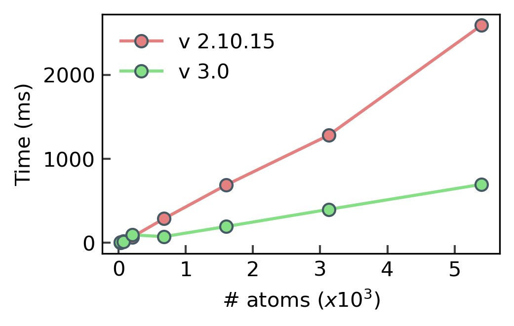
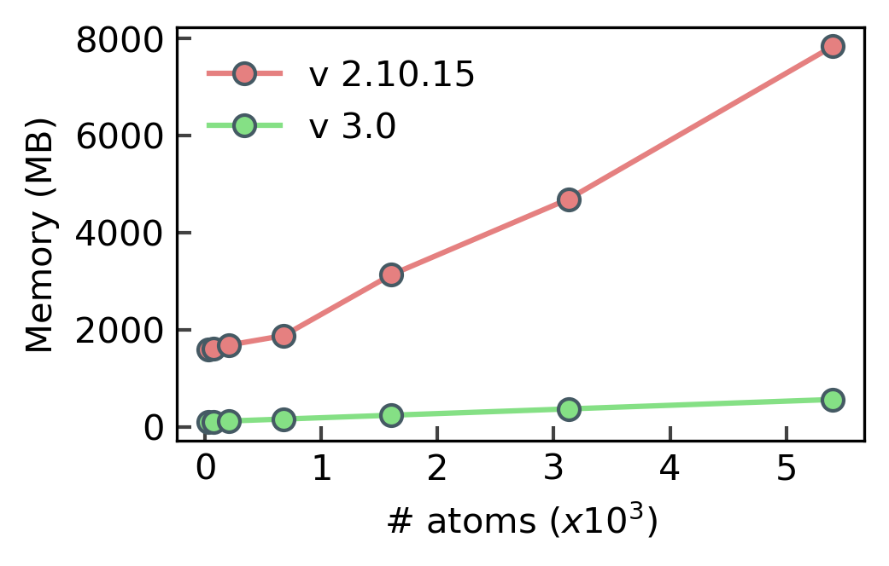

# pyscal3 - python Structural Environment Calculator

**pyscal3** is a completely new version of [pyscal](https://docs.pyscal.org/en/latest/), a python module for the calculation of local atomic structural environments including [Steinhardt's bond orientational order parameters](https://journals.aps.org/prb/abstract/10.1103/PhysRevB.28.784) during post-processing of atomistic simulation data. `pyscal3` is faster and can handle a large number of atoms, with a much more user-friendly and intuitive interface.  

Features of `pyscal3` includes:  

- fast and efficient calculations using C++ and expansion using python.
- more structure creation routines, including defects such as grain boundaries.
- calculation of [Steinhardt's order parameters](https://journals.aps.org/prb/abstract/10.1103/PhysRevB.28.784) and their [averaged version](https://aip.scitation.org/doi/full/10.1063/1.2977970) and [disorder parameters](https://doi.org/10.1063/1.3656762).
- links with [Voro++](http://math.lbl.gov/voro++/)> code, for calculation of [Steinhardt parameters weighted using face area of Voronoi polyhedra](https://aip.scitation.org/doi/full/10.1063/1.4774084).
- classification of atoms as [solid or liquid](https://link.springer.com/chapter/10.1007/b99429).
- clustering of particles based on a user defined property.
- methods for calculating radial distribution function, voronoi volumeof particles, number of vertices and face area of voronoi polyhedra and coordination number.
- calculation of angular parameters such as [for identification of diamond structure](https://journals.aps.org/prb/abstract/10.1103/PhysRevB.47.15717) and [Ackland-Jones](https://doi.org/10.1103/PhysRevB.73.054104) angular parameters.
- [Centrosymmetry parameter](https://doi.org/10.1103/PhysRevB.58.11085) for identification of defects.
- [Adaptive common neighbor analysis](https://iopscience.iop.org/article/10.1088/0965-0393/20/4/045021) for identification of crystal structures.
- [Cowley short-range](https://doi.org/10.1103/PhysRev.120.1648) order parameters.

## Why version 3?

pyscal v3 is a new version with mostly updated codebase and breaking changes. Anybody who has working pyscal code will need to update it to get it working with this new version. Therefore, it is necessary to discuss why this new version was needed and the benefits of updating.

### Version 3 is much faster

In the plot below, the time needed to calculate neighbors with the 'cutoff' method for systems with varying number of atoms with versions 2.10.15 and 3.0 is shown.

v3 is faster for all system sizes. At a system size of about 50,000 atoms, v3 is about 4x faster.

### Version 3 uses less memory

A major issue with pyscal v2.x series was that it not useful for large system sizes due to the large amount of memory needed. In the plot below, the memory usage of both versions for the same calculation above is shown.

v3 uses less memory, for a system size of 50,000 atoms, v3 uses 14x less memory. A more interesting feature is the slope of the data, or how much the memory scales with the system size. For v3 it is only 0.008, while for v2 it is .12! For a system of 1 million atoms, v2 would use 117 GB of memory while v3 would need only 8 GB, making larger calculations accessible (these numbers will be updated after real use-case tests).

### What are reasons for these benefits?

- The older C++ atoms class is deprecated. Instead, it is store as python dictionary. Therefore the copying between python and C++ sides is avoided.
- The atoms python dictionary is directly exposed to the C++ side. The dictionary is passed by reference, which allows in-place modification directly.

### What are the other feature updates?

The new version includes a number of new features and quality of life improvements. Please check the examples for details.

## Citing the work

If you use pyscal in your work, the citation of the [following article](https://joss.theoj.org/papers/10.21105/joss.01824) will be greatly appreciated:

Sarath Menon, Grisell Díaz Leines and Jutta Rogal (2019). pyscal: A python module for structural analysis of atomic environments. Journal of Open Source Software, 4(43), 1824, https://doi.org/10.21105/joss.01824