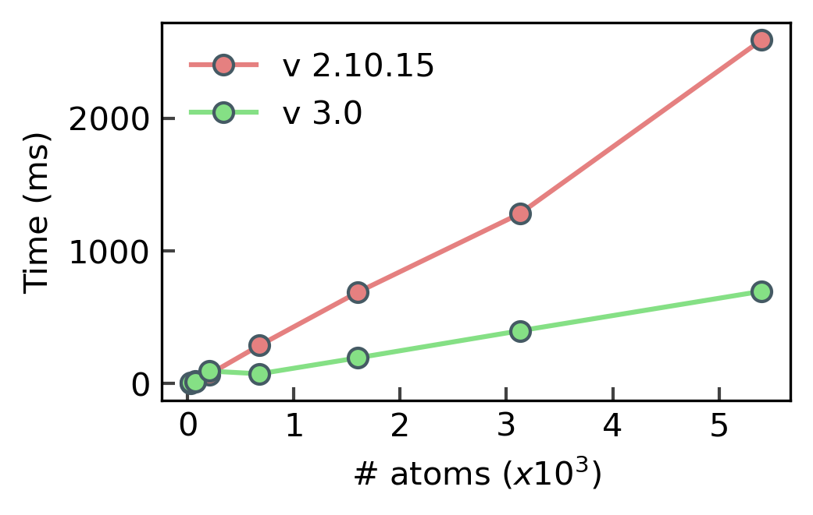
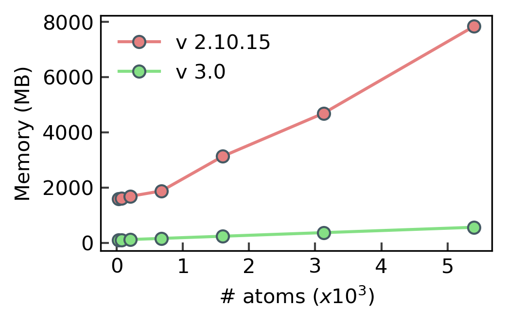

# pyscal3 - python Structural Environment Calculator


**pyscal3** is a Python library for computing local atomic structural environments from atomistic simulation data. It provides fast C++-backed calculations of [Steinhardt's bond-orientational order parameters](https://journals.aps.org/prb/abstract/10.1103/PhysRevB.28.784), common neighbor analysis, Voronoi tessellation, and many more descriptors — all through a clean functional API built on [ASE](https://wiki.fysik.dtu.dk/ase/) (Atomic Simulation Environment).

## Key features

- **ASE-first API** — all functions take and return standard `ase.Atoms` objects. Results are stored in `atoms.arrays` and `atoms.info` with the `pyscal_` prefix.
- **Fast C++ core** — neighbor finding, Steinhardt parameters, CNA, and other descriptors run in compiled C++ via pybind11.
- **Comprehensive descriptor suite:**
  - [Steinhardt bond-orientational order parameters](https://journals.aps.org/prb/abstract/10.1103/PhysRevB.28.784) and their [averaged](https://aip.scitation.org/doi/full/10.1063/1.2977970) and [disorder](https://doi.org/10.1063/1.3656762) variants
  - [Wigner $W_l$](https://journals.aps.org/prb/abstract/10.1103/PhysRevB.28.784) third-order rotational invariants
  - [Minkowski structure metrics](https://doi.org/10.1063/1.4774084) — Voronoi-area-weighted, parameter-free $q_l$
  - [Voronoi tessellation](http://math.lbl.gov/voro++) for structural vector and Voronoi volume
  - [Common neighbor analysis](https://iopscience.iop.org/article/10.1088/0965-0393/20/4/045021) (CNA, adaptive CNA, diamond CNA)
  - [Solid/liquid classification](https://link.springer.com/chapter/10.1007/b99429) with clustering
  - [Centrosymmetry parameter](https://doi.org/10.1103/PhysRevB.58.11085)
  - [Angular parameters](https://journals.aps.org/prb/abstract/10.1103/PhysRevB.47.15717) and [Ackland-Jones $\chi$ parameters and classifier](https://doi.org/10.1103/PhysRevB.73.054104)
  - Coordination measures — coordination number, [effective coordination](https://doi.org/10.1002/anie.197000251), and [generalised coordination](https://doi.org/10.1126/science.aab3501)
  - Angular and bond-length distribution functions
  - [Cowley short-range order](https://doi.org/10.1103/PhysRev.120.1648)
  - [Entropy parameter](https://doi.org/10.1063/1.4998408) for structure distinction
  - Atomic deformation — strain, von Mises invariant, [$D^2_{\min}$](https://doi.org/10.1103/PhysRevE.57.7192), [slip vector](https://doi.org/10.1103/PhysRevLett.87.165507)
  - Wigner-Seitz defect analysis — vacancies, interstitials, antisites
  - [Atomic Cluster Expansion](https://doi.org/10.1103/PhysRevB.99.014104) descriptors
- **Structure creation** — built-in routines for common crystals, elements, general lattices, and grain boundaries.
- **Trajectory support** — memory-efficient analysis of large LAMMPS dump trajectories.

## Quick start

```python
from ase.build import bulk
import pyscal3

# Create a structure
atoms = bulk("Cu", "fcc", cubic=True).repeat(3)

# Find neighbors
pyscal3.find_neighbors(atoms, method="cutoff", cutoff=0)

# Calculate descriptors
q4, q6 = pyscal3.steinhardt_parameter(atoms, l=[4, 6])
print(atoms.arrays["pyscal_q6"].mean())   # ≈ 0.57 for fcc

# Common neighbor analysis
result = pyscal3.common_neighbor_analysis(atoms)
print(result)  # {'fcc': 108, 'hcp': 0, 'bcc': 0, 'ico': 0, 'others': 0}
```

Results are stored directly on the ASE `Atoms` object:

- **Per-atom data** → `atoms.arrays["pyscal_<name>"]` (NumPy arrays)
- **System-level or ragged data** → `atoms.info["pyscal_<name>"]`

This makes it easy to combine pyscal3 with ASE's I/O, visualisation, and analysis tools.


## Why version 4?

pyscal v4 is a major rewrite. The Python interface has been redesigned around [ASE](https://wiki.fysik.dtu.dk/ase/) and is no longer source-compatible with v3. Working v3 code will need small changes to run on v4. It is therefore worth describing why this rewrite was needed and what it gives in return.

### ASE `Atoms` is now the data structure

pyscal no longer ships its own `System` or `Atoms` class. Every public function takes an `ase.Atoms` object as its first argument and writes results back to that same object — per-atom quantities into `atoms.arrays["pyscal_*"]` and global or ragged quantities into `atoms.info["pyscal_*"]`. Any structure that ASE can read or build can be analysed with pyscal directly, and the results travel naturally to the rest of the ecosystem (ASE I/O, pymatgen, OVITO, plotting libraries).

### A functional API

Every descriptor is a top-level function. There is no system state to keep in sync, no method-chaining order to remember, no class to subclass when adding a new descriptor. A typical session is

``` python
import pyscal3
pyscal3.find_neighbors(atoms, method="cutoff", cutoff=0)
q4, q6 = pyscal3.steinhardt_parameter(atoms, l=[4, 6])
labels = pyscal3.identify_ackland_jones(atoms)
```

Adding a new descriptor in v4 means writing a single function — not extending a class hierarchy.

### A larger descriptor library

In addition to everything that was in v3, this release adds Wigner $W_l$ parameters, Minkowski structure metrics, Ackland-Jones structural classification, three coordination-number variants, angular and bond-length distribution functions, atomic deformation descriptors (strain tensor, von Mises invariant, $D^2_{\min}$, slip vector), Wigner-Seitz defect analysis, and Atomic Cluster Expansion (ACE) descriptors up to body order four. Each is documented and benchmarked against published reference values where available.

### What is the migration path?

Code that used to read

``` python
from pyscal3 import System
sys = System('conf.dump')
sys.find.neighbors(method='cutoff', cutoff=3)
sys.calculate.steinhardt_parameter([4, 6])
sys.atoms.solid
```

now reads

``` python
import pyscal3
from ase.io import read
atoms = read('conf.dump', format='lammps-dump-text')
pyscal3.find_neighbors(atoms, method='cutoff', cutoff=3)
pyscal3.steinhardt_parameter(atoms, l=[4, 6])
atoms.arrays['pyscal_solid']
```

If you need the v3 API, pin `pyscal3<4`.


## Why version 3?

pyscal v3 was a major rewrite of the v2.x line, with breaking changes that required users to update their code. The two main motivations remain visible in v4 and are worth recording here.

### Version 3 is much faster

In the plot below, the time needed to calculate neighbors with the `cutoff` method for systems with varying number of atoms with versions 2.10.15 and 3.0 is shown.



v3 is faster for all system sizes. At a system size of about 50,000 atoms, v3 is about 4x faster.

### Version 3 uses less memory

A major issue with the v2.x series was that it was not useful for large system sizes due to the large amount of memory needed. In the plot below, the memory usage of both versions for the same calculation above is shown.



v3 uses less memory; for a system size of 50,000 atoms, v3 uses 14x less memory. A more interesting feature is the slope of the data, or how much the memory scales with the system size. For v3 it is only 0.008, while for v2 it is 0.12. For a system of 1 million atoms, v2 would use 117 GB of memory while v3 needs only 8 GB, making larger calculations accessible.

### What are the reasons for these benefits?

- The older C++ atoms class was deprecated. Atoms are stored as a Python dictionary instead, so copying between Python and C++ is avoided.
- The atoms dictionary is exposed to the C++ side by reference, which allows in-place modification.

These design choices carry over into v4, where the dictionary has simply been replaced by an `ase.Atoms` object whose `arrays` and `info` mappings serve the same purpose.


## Citing

If you use pyscal in your work, please cite:

> Sarath Menon, Grisell Díaz Leines and Jutta Rogal (2019). pyscal: A python module for structural analysis of atomic environments. *Journal of Open Source Software*, 4(43), 1824, https://doi.org/10.21105/joss.01824
